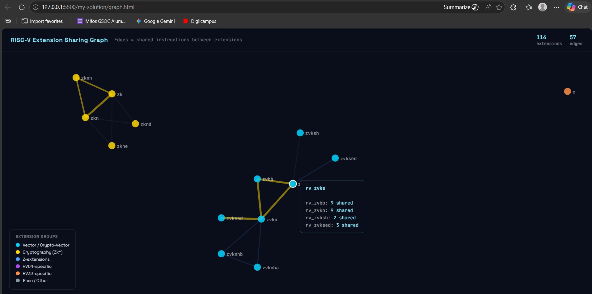

# RISC-V Instruction Set Explorer

LFX Mentorship Coding Challenge - Summer 2026
Mentor: Rafael Sene (RISC-V International)

## Overview

This project implements the three-tier RISC-V Instruction Set Explorer coding challenge. It parses, cross-references, and visualizes the RISC-V ISA extension ecosystem using data from the riscv-extensions-landscape and riscv-isa-manual repositories.

## Project Structure

my-solution/
- solution_tier1.py      # Tier 1 - Instruction set parsing
- solution_tier2.py      # Tier 2 - Cross-reference with ISA manual
- graph_extensions.py    # Tier 3 - Extension sharing graph
- test_solution.py       # Tier 3 - Unit tests (imports from solution modules)
- graph.html             # Generated visual graph (after running Tier 3)
- README.md              # This file

## Requirements

- Python 3.8+
- Git (for auto-cloning the ISA manual in Tier 2)
- A modern browser (for Tier 3 HTML graph)

No external Python packages are required.

## Usage

Run These Commands In my-solution Directory
```~/riscv-extensions-landscape/my-solution$ ```

### Tier 1 - Instruction Set Parsing

Reads ../src/instr_dict.json, groups instructions by extension, and reports a summary table plus multi-extension instructions.

```bash
python3 solution_tier1.py
```

### Tier 2 - Cross-Reference with ISA Manual

Clones/reuses ../riscv-isa-manual, scans AsciiDoc files under src/, and cross-references extension names against instr_dict.json.

```bash
python3 solution_tier2.py
```

### Tier 3 - Extension Sharing Graph

Generates both text graph output and an interactive HTML visualization.

```bash
python3 graph_extensions.py
```

This creates graph.html in the current directory.

### Run Unit Tests

```bash
python3 test_solution.py
```
### Extension Sharing Graph (Interactive)



The graph visualizes which extensions share instructions. Nodes are extensions, edges connect extensions that have at least one instruction in common. Thicker gold lines mean more shared instructions. You can zoom, drag, and hover over nodes to see connection details.

## Exact Output

### Tier 1

```text
Loading instruction dictionary from: /home/gk/riscv-extensions-landscape/src/instr_dict.json
Total instructions loaded: 1188

=================================================================
EXTENSION TAG                    COUNT   EXAMPLE MNEMONIC
=================================================================
rv32_c                               1 instructions | e.g. C_JAL
rv32_c_f                             4 instructions | e.g. C_FLW
rv32_d_zfa                           2 instructions | e.g. FMVH_X_D
rv32_zk                             10 instructions | e.g. AES32DSI
rv32_zkn                            10 instructions | e.g. AES32DSI
rv32_zknd                            2 instructions | e.g. AES32DSI
rv32_zkne                            2 instructions | e.g. AES32ESI
rv32_zknh                            6 instructions | e.g. SHA512SIG0H
rv64_a                              11 instructions | e.g. AMOADD_D
rv64_c                              10 instructions | e.g. C_ADDIW
rv64_d                               6 instructions | e.g. FCVT_D_L
rv64_f                               4 instructions | e.g. FCVT_L_S
rv64_h                               3 instructions | e.g. HLV_D
rv64_i                              15 instructions | e.g. ADDIW
rv64_m                               5 instructions | e.g. DIVUW
rv64_q                               4 instructions | e.g. FCVT_L_Q
rv64_q_zfa                           2 instructions | e.g. FMVH_X_Q
rv64_zacas                           1 instructions | e.g. AMOCAS_Q
rv64_zba                             5 instructions | e.g. ADD_UW
rv64_zbb                             9 instructions | e.g. CLZW
rv64_zbkb                            5 instructions | e.g. PACKW
rv64_zbp                             5 instructions | e.g. GORCI
rv64_zbs                             4 instructions | e.g. BCLRI
rv64_zcb                             1 instructions | e.g. C_ZEXT_W
rv64_zfh                             4 instructions | e.g. FCVT_H_L
rv64_zk                             16 instructions | e.g. AES64DS
rv64_zkn                            16 instructions | e.g. AES64DS
rv64_zknd                            5 instructions | e.g. AES64DS
rv64_zkne                            4 instructions | e.g. AES64ES
rv64_zknh                            4 instructions | e.g. SHA512SIG0
rv64_zkr                             1 instructions | e.g. CSRRAND64
rv64_zks                             5 instructions | e.g. PACKW
rv_a                                11 instructions | e.g. AMOADD_W
rv_c                                23 instructions | e.g. C_ADD
rv_c_d                               4 instructions | e.g. C_FLD
rv_d                                26 instructions | e.g. FADD_D
rv_d_zfa                             8 instructions | e.g. FCVTMOD_W_D
rv_d_zfhmin                          2 instructions | e.g. FCVT_D_H
rv_f                                26 instructions | e.g. FADD_S
rv_f_zfa                             7 instructions | e.g. FLEQ_S
rv_h                                13 instructions | e.g. HFENCE_GVMA
rv_i                                37 instructions | e.g. ADD
rv_m                                 8 instructions | e.g. DIV
rv_q                                30 instructions | e.g. FADD_Q
rv_q_zfa                             7 instructions | e.g. FLEQ_Q
rv_q_zfhmin                          2 instructions | e.g. FCVT_H_Q
rv_s                                 2 instructions | e.g. SFENCE_VMA
rv_sdext                             1 instructions | e.g. DRET
rv_smrnmi                            1 instructions | e.g. MNRET
rv_ssctr                             1 instructions | e.g. SCTRCLR
rv_svinval                           3 instructions | e.g. SFENCE_INVAL_IR
rv_svinval_h                         2 instructions | e.g. HINVAL_GVMA
rv_system                            2 instructions | e.g. MRET
rv_u                                 1 instructions | e.g. URET
rv_v                               627 instructions | e.g. VAADD_VV
rv_zabha                            18 instructions | e.g. AMOADD_B
rv_zabha_zacas                       2 instructions | e.g. AMOCAS_B
rv_zacas                             2 instructions | e.g. AMOCAS_D
rv_zalasr                            8 instructions | e.g. LB_AQ
rv_zawrs                             2 instructions | e.g. WRS_NTO
rv_zba                               3 instructions | e.g. SH1ADD
rv_zbb                              17 instructions | e.g. ANDN
rv_zbc                               3 instructions | e.g. CLMUL
rv_zbkb                              7 instructions | e.g. ANDN
rv_zbkc                              2 instructions | e.g. CLMUL
rv_zbkx                              2 instructions | e.g. XPERM4
rv_zbp                               1 instructions | e.g. XPERM16
rv_zbs                               4 instructions | e.g. BCLR
rv_zcb                              11 instructions | e.g. C_LBU
rv_zcmop                             1 instructions | e.g. C_MOP_N
rv_zcmp                              6 instructions | e.g. CM_MVA01S
rv_zcmt                              1 instructions | e.g. CM_JALT
rv_zfbfmin                           2 instructions | e.g. FCVT_BF16_S
rv_zfh                              22 instructions | e.g. FADD_H
rv_zfh_zfa                           7 instructions | e.g. FLEQ_H
rv_zfhmin                            6 instructions | e.g. FCVT_H_S
rv_zibi                              2 instructions | e.g. BEQI
rv_zicbo                             4 instructions | e.g. CBO_CLEAN
rv_zicfiss                           2 instructions | e.g. SSAMOSWAP_D
rv_zicond                            2 instructions | e.g. CZERO_EQZ
rv_zicsr                             6 instructions | e.g. CSRRC
rv_zifencei                          1 instructions | e.g. FENCE_I
rv_zimop                             2 instructions | e.g. MOP_R_N
rv_zk                               15 instructions | e.g. ANDN
rv_zkn                              15 instructions | e.g. ANDN
rv_zknh                              4 instructions | e.g. SHA256SIG0
rv_zkr                               1 instructions | e.g. CSRRAND
rv_zks                              15 instructions | e.g. ANDN
rv_zksed                             2 instructions | e.g. SM4ED
rv_zksh                              2 instructions | e.g. SM3P0
rv_zvabd                             5 instructions | e.g. VABD_VV
rv_zvbb                             16 instructions | e.g. VANDN_VV
rv_zvbc                              4 instructions | e.g. VCLMUL_VV
rv_zvfbdot32f                        1 instructions | e.g. VFBDOT_VV
rv_zvfbfmin                          2 instructions | e.g. VFNCVTBF16_F_F_W
rv_zvfbfwma                          2 instructions | e.g. VFWMACCBF16_VF
rv_zvfofp4min                        1 instructions | e.g. VFEXT_VF2
rv_zvfofp8min                        3 instructions | e.g. VFNCVT_F_F_Q
rv_zvfqbdot8f                        2 instructions | e.g. VFQBDOT_ALT_VV
rv_zvfqldot8f                        2 instructions | e.g. VFQLDOT_ALT_VV
rv_zvfwbdot16bf                      1 instructions | e.g. VFWBDOT_VV
rv_zvfwldot16bf                      1 instructions | e.g. VFWLDOT_VV
rv_zvkg                              2 instructions | e.g. VGHSH_VV
rv_zvkn                             23 instructions | e.g. VAESDF_VS
rv_zvkned                           11 instructions | e.g. VAESDF_VS
rv_zvknha                            3 instructions | e.g. VSHA2CH_VV
rv_zvknhb                            3 instructions | e.g. VSHA2CH_VV
rv_zvks                             14 instructions | e.g. VANDN_VV
rv_zvksed                            3 instructions | e.g. VSM4K_VI
rv_zvksh                             2 instructions | e.g. VSM3C_VI
rv_zvqbdot8i                         2 instructions | e.g. VQBDOTS_VV
rv_zvqdotq                           7 instructions | e.g. VQDOT_VV
rv_zvqldot8i                         2 instructions | e.g. VQLDOTS_VV
rv_zvzip                             5 instructions | e.g. VPAIRE_VV
=================================================================

Total extensions found : 114
Total instruction tags : 1343  (some counted in multiple extensions)

=================================================================
INSTRUCTIONS BELONGING TO MORE THAN ONE EXTENSION
=================================================================
  MNEMONIC                  EXTENSIONS
  -------------------------------------------------------
  AES32DSI                  rv32_zknd, rv32_zk, rv32_zkn
  AES32DSMI                 rv32_zknd, rv32_zk, rv32_zkn
  AES32ESI                  rv32_zkne, rv32_zk, rv32_zkn
  AES32ESMI                 rv32_zkne, rv32_zk, rv32_zkn
  AES64DS                   rv64_zknd, rv64_zkn, rv64_zk
  AES64DSM                  rv64_zknd, rv64_zkn, rv64_zk
  AES64ES                   rv64_zkne, rv64_zkn, rv64_zk
  AES64ESM                  rv64_zkne, rv64_zkn, rv64_zk
  AES64IM                   rv64_zknd, rv64_zkn, rv64_zk
  AES64KS1I                 rv64_zknd, rv64_zkn, rv64_zkne, rv64_zk
  AES64KS2                  rv64_zknd, rv64_zkn, rv64_zkne, rv64_zk
  ANDN                      rv_zbb, rv_zkn, rv_zks, rv_zk, rv_zbkb
  CLMUL                     rv_zbc, rv_zkn, rv_zks, rv_zk, rv_zbkc
  CLMULH                    rv_zbc, rv_zkn, rv_zks, rv_zk, rv_zbkc
  ORN                       rv_zbb, rv_zkn, rv_zks, rv_zk, rv_zbkb
  PACK                      rv_zbkb, rv_zkn, rv_zks, rv_zk
  PACKH                     rv_zbkb, rv_zkn, rv_zks, rv_zk
  PACKW                     rv64_zbkb, rv64_zks, rv64_zkn, rv64_zk
  ROL                       rv_zbb, rv_zkn, rv_zks, rv_zk, rv_zbkb
  ROLW                      rv64_zbb, rv64_zks, rv64_zkn, rv64_zk, rv64_zbkb
  ROR                       rv_zbb, rv_zkn, rv_zks, rv_zk, rv_zbkb
  RORI                      rv64_zbb, rv64_zks, rv64_zkn, rv64_zk, rv64_zbkb
  RORIW                     rv64_zbb, rv64_zks, rv64_zkn, rv64_zk, rv64_zbkb
  RORW                      rv64_zbb, rv64_zks, rv64_zkn, rv64_zk, rv64_zbkb
  SHA256SIG0                rv_zknh, rv_zkn, rv_zk
  SHA256SIG1                rv_zknh, rv_zkn, rv_zk
  SHA256SUM0                rv_zknh, rv_zkn, rv_zk
  SHA256SUM1                rv_zknh, rv_zkn, rv_zk
  SHA512SIG0                rv64_zknh, rv64_zkn, rv64_zk
  SHA512SIG0H               rv32_zknh, rv32_zk, rv32_zkn
  SHA512SIG0L               rv32_zknh, rv32_zk, rv32_zkn
  SHA512SIG1                rv64_zknh, rv64_zkn, rv64_zk
  SHA512SIG1H               rv32_zknh, rv32_zk, rv32_zkn
  SHA512SIG1L               rv32_zknh, rv32_zk, rv32_zkn
  SHA512SUM0                rv64_zknh, rv64_zkn, rv64_zk
  SHA512SUM0R               rv32_zknh, rv32_zk, rv32_zkn
  SHA512SUM1                rv64_zknh, rv64_zkn, rv64_zk
  SHA512SUM1R               rv32_zknh, rv32_zk, rv32_zkn
  SM3P0                     rv_zksh, rv_zks
  SM3P1                     rv_zksh, rv_zks
  SM4ED                     rv_zksed, rv_zks
  SM4KS                     rv_zksed, rv_zks
  VAESDF_VS                 rv_zvkned, rv_zvkn
  VAESDF_VV                 rv_zvkned, rv_zvkn
  VAESDM_VS                 rv_zvkned, rv_zvkn
  VAESDM_VV                 rv_zvkned, rv_zvkn
  VAESEF_VS                 rv_zvkned, rv_zvkn
  VAESEF_VV                 rv_zvkned, rv_zvkn
  VAESEM_VS                 rv_zvkned, rv_zvkn
  VAESEM_VV                 rv_zvkned, rv_zvkn
  VAESKF1_VI                rv_zvkned, rv_zvkn
  VAESKF2_VI                rv_zvkned, rv_zvkn
  VAESZ_VS                  rv_zvkned, rv_zvkn
  VANDN_VV                  rv_zvbb, rv_zvks, rv_zvkn
  VANDN_VX                  rv_zvbb, rv_zvks, rv_zvkn
  VBREV8_V                  rv_zvbb, rv_zvks, rv_zvkn
  VREV8_V                   rv_zvbb, rv_zvks, rv_zvkn
  VROL_VV                   rv_zvbb, rv_zvks, rv_zvkn
  VROL_VX                   rv_zvbb, rv_zvks, rv_zvkn
  VROR_VI                   rv_zvbb, rv_zvks, rv_zvkn
  VROR_VV                   rv_zvbb, rv_zvks, rv_zvkn
  VROR_VX                   rv_zvbb, rv_zvks, rv_zvkn
  VSHA2CH_VV                rv_zvknha, rv_zvknhb, rv_zvkn
  VSHA2CL_VV                rv_zvknha, rv_zvknhb, rv_zvkn
  VSHA2MS_VV                rv_zvknha, rv_zvknhb, rv_zvkn
  VSM3C_VI                  rv_zvksh, rv_zvks
  VSM3ME_VV                 rv_zvksh, rv_zvks
  VSM4K_VI                  rv_zvksed, rv_zvks
  VSM4R_VS                  rv_zvksed, rv_zvks
  VSM4R_VV                  rv_zvksed, rv_zvks
  XNOR                      rv_zbb, rv_zkn, rv_zks, rv_zk, rv_zbkb
  XPERM4                    rv_zbkx, rv_zkn, rv_zks, rv_zk
  XPERM8                    rv_zbkx, rv_zkn, rv_zks, rv_zk
=================================================================

Total multi-extension instructions: 73
```

> **Note:** The coding challenge example shows `rv_zba | 4 instructions` as an illustrative sample. The actual data in instr_dict.json contains 3 instructions for rv_zba (SH1ADD, SH2ADD, SH3ADD), which our output correctly reflects.

### Tier 2

```text
[1] Loading instruction dictionary from: /home/gk/riscv-extensions-landscape/src/instr_dict.json
    Total unique extension tags in JSON : 114

[2] Checking ISA manual repo at: /home/gk/riscv-extensions-landscape/riscv-isa-manual
    Repo already exists, skipping clone.

[3] Scanning AsciiDoc files in: /home/gk/riscv-extensions-landscape/riscv-isa-manual/src
    Found 138 .adoc files to scan
    Raw extension mentions found in manual: 163

======================================================================
CROSS-REFERENCE REPORT: instr_dict.json  vs  ISA Manual
======================================================================

  Matched (in both)                   : 53
  JSON only (not in manual)           : 32
  Manual only (not in JSON)           : 101
  TOTAL unique JSON extensions        : 85

----------------------------------------------------------------------
MATCHED EXTENSIONS (present in both sources)
----------------------------------------------------------------------
  a                    | JSON: rv64_a, rv_a              | Manual: RV32A, RV64A
  c                    | JSON: rv32_c, rv64_c, rv_c      | Manual: C"
  d                    | JSON: rv64_d, rv_d              | Manual: RV32D, RV64D
  f                    | JSON: rv64_f, rv_f              | Manual: RV32F, RV64F
  i                    | JSON: rv64_i, rv_i              | Manual: RV128I, RV32I, RV64I
  m                    | JSON: rv64_m, rv_m              | Manual: RV32M, RV64M
  q                    | JSON: rv64_q, rv_q              | Manual: RV32Q, RV64Q
  smrnmi               | JSON: rv_smrnmi                 | Manual: Smrnmi
  ssctr                | JSON: rv_ssctr                  | Manual: Ssctr
  svinval              | JSON: rv_svinval                | Manual: Svinval
  zabha                | JSON: rv_zabha                  | Manual: Zabha
  zacas                | JSON: rv64_zacas, rv_zacas      | Manual: Zacas
  zalasr               | JSON: rv_zalasr                 | Manual: Zalasr
  zawrs                | JSON: rv_zawrs                  | Manual: Zawrs
  zba                  | JSON: rv64_zba, rv_zba          | Manual: Zba
  zbb                  | JSON: rv64_zbb, rv_zbb          | Manual: Zbb
  zbc                  | JSON: rv_zbc                    | Manual: Zbc
  zbkb                 | JSON: rv64_zbkb, rv_zbkb        | Manual: Zbkb
  zbkc                 | JSON: rv_zbkc                   | Manual: Zbkc
  zbkx                 | JSON: rv_zbkx                   | Manual: Zbkx
  zbs                  | JSON: rv64_zbs, rv_zbs          | Manual: Zbs
  zcb                  | JSON: rv64_zcb, rv_zcb          | Manual: Zcb
  zcmop                | JSON: rv_zcmop                  | Manual: Zcmop
  zcmp                 | JSON: rv_zcmp                   | Manual: Zcmp
  zcmt                 | JSON: rv_zcmt                   | Manual: Zcmt
  zfbfmin              | JSON: rv_zfbfmin                | Manual: Zfbfmin
  zfh                  | JSON: rv64_zfh, rv_zfh          | Manual: Zfh
  zfhmin               | JSON: rv_zfhmin                 | Manual: Zfhmin
  zicfiss              | JSON: rv_zicfiss                | Manual: Zicfiss
  zicond               | JSON: rv_zicond                 | Manual: Zicond
  zicsr                | JSON: rv_zicsr                  | Manual: Zicsr
  zifencei             | JSON: rv_zifencei               | Manual: Zifencei
  zimop                | JSON: rv_zimop                  | Manual: Zimop
  zkn                  | JSON: rv32_zkn, rv64_zkn, rv_zkn | Manual: Zkn
  zknd                 | JSON: rv32_zknd, rv64_zknd      | Manual: Zknd
  zkne                 | JSON: rv32_zkne, rv64_zkne      | Manual: Zkne
  zknh                 | JSON: rv32_zknh, rv64_zknh, rv_zknh | Manual: Zknh
  zkr                  | JSON: rv64_zkr, rv_zkr          | Manual: Zkr
  zks                  | JSON: rv64_zks, rv_zks          | Manual: Zks
  zksed                | JSON: rv_zksed                  | Manual: Zksed
  zksh                 | JSON: rv_zksh                   | Manual: Zksh
  zvbb                 | JSON: rv_zvbb                   | Manual: Zvbb
  zvbc                 | JSON: rv_zvbc                   | Manual: Zvbc
  zvfbfmin             | JSON: rv_zvfbfmin               | Manual: Zvfbfmin
  zvfbfwma             | JSON: rv_zvfbfwma               | Manual: Zvfbfwma
  zvkg                 | JSON: rv_zvkg                   | Manual: Zvkg
  zvkn                 | JSON: rv_zvkn                   | Manual: Zvkn
  zvkned               | JSON: rv_zvkned                 | Manual: Zvkned
  zvknha               | JSON: rv_zvknha                 | Manual: Zvknha
  zvknhb               | JSON: rv_zvknhb                 | Manual: Zvknhb
  zvks                 | JSON: rv_zvks                   | Manual: Zvks
  zvksed               | JSON: rv_zvksed                 | Manual: Zvksed
  zvksh                | JSON: rv_zvksh                  | Manual: Zvksh

----------------------------------------------------------------------
JSON ONLY (in instr_dict.json but NOT mentioned in ISA manual)
----------------------------------------------------------------------
  c_d                  | original tag(s): rv_c_d
  c_f                  | original tag(s): rv32_c_f
  d_zfa                | original tag(s): rv32_d_zfa, rv_d_zfa
  d_zfhmin             | original tag(s): rv_d_zfhmin
  f_zfa                | original tag(s): rv_f_zfa
  h                    | original tag(s): rv64_h, rv_h
  q_zfa                | original tag(s): rv64_q_zfa, rv_q_zfa
  q_zfhmin             | original tag(s): rv_q_zfhmin
  s                    | original tag(s): rv_s
  sdext                | original tag(s): rv_sdext
  svinval_h            | original tag(s): rv_svinval_h
  system               | original tag(s): rv_system
  u                    | original tag(s): rv_u
  v                    | original tag(s): rv_v
  zabha_zacas          | original tag(s): rv_zabha_zacas
  zbp                  | original tag(s): rv64_zbp, rv_zbp
  zfh_zfa              | original tag(s): rv_zfh_zfa
  zibi                 | original tag(s): rv_zibi
  zicbo                | original tag(s): rv_zicbo
  zk                   | original tag(s): rv32_zk, rv64_zk, rv_zk
  zvabd                | original tag(s): rv_zvabd
  zvfbdot32f           | original tag(s): rv_zvfbdot32f
  zvfofp4min           | original tag(s): rv_zvfofp4min
  zvfofp8min           | original tag(s): rv_zvfofp8min
  zvfqbdot8f           | original tag(s): rv_zvfqbdot8f
  zvfqldot8f           | original tag(s): rv_zvfqldot8f
  zvfwbdot16bf         | original tag(s): rv_zvfwbdot16bf
  zvfwldot16bf         | original tag(s): rv_zvfwldot16bf
  zvqbdot8i            | original tag(s): rv_zvqbdot8i
  zvqdotq              | original tag(s): rv_zvqdotq
  zvqldot8i            | original tag(s): rv_zvqldot8i
  zvzip                | original tag(s): rv_zvzip

----------------------------------------------------------------------
MANUAL ONLY (in ISA manual but NOT in instr_dict.json)
----------------------------------------------------------------------
  e                    | found as: RV32E, RV64E
  high_access          | found as: rv32_high_access
  lui                  | found as: rv64_lui
  smaia                | found as: Smaia
  smcdeleg             | found as: Smcdeleg
  smcntrpmf            | found as: Smcntrpmf
  smcsrind             | found as: Smcsrind
  smctr                | found as: Smctr
  smdbltrp             | found as: Smdbltrp
  smepmp               | found as: Smepmp
  smmpm                | found as: Smmpm
  smnpm                | found as: Smnpm
  smstateen            | found as: Smstateen
  ssaia                | found as: Ssaia
  ssamoswap            | found as: rv32_ssamoswap, rv64_ssamoswap
  ssccfg               | found as: Ssccfg
  ssccptr              | found as: Ssccptr
  sscofpmf             | found as: Sscofpmf
  sscounterenw         | found as: Sscounterenw
  sscsrind             | found as: Sscsrind
  ssdbltrap            | found as: Ssdbltrap
  ssdbltrp             | found as: Ssdbltrp
  ssnpm                | found as: Ssnpm
  sspm                 | found as: Sspm
  ssptead              | found as: Ssptead
  ssqosid              | found as: Ssqosid
  ssstateen            | found as: Ssstateen
  ssstrict             | found as: Ssstrict
  sstc                 | found as: Sstc
  sstvala              | found as: Sstvala
  sstvecd              | found as: Sstvecd
  ssu64xl              | found as: Ssu64xl
  svade                | found as: Svade
  svadu                | found as: Svadu
  svbare               | found as: Svbare
  svnapot              | found as: Svnapot
  svpbmt               | found as: Svpbmt
  svrsw60t59b          | found as: Svrsw60t59b
  svvptc               | found as: Svvptc
  w_sex                | found as: rv64_w_sex
  za128rs              | found as: Za128rs
  za64rs               | found as: Za64rs
  zaamo                | found as: Zaamo
  zalrsc               | found as: Zalrsc
  zam                  | found as: Zam
  zama16b              | found as: Zama16b
  zbk                  | found as: Zbk
  zca                  | found as: Zca
  zcd                  | found as: Zcd
  zce                  | found as: Zce
  zcf                  | found as: Zcf
  zclsd                | found as: Zclsd
  zdinx                | found as: Zdinx
  zfa                  | found as: Zfa
  zfinx                | found as: Zfinx
  zhinx                | found as: Zhinx
  zhinxmin             | found as: Zhinxmin
  zic64b               | found as: Zic64b
  zicbom               | found as: Zicbom
  zicbop               | found as: Zicbop
  zicboz               | found as: Zicboz
  ziccamoa             | found as: Ziccamoa
  ziccamoc             | found as: Ziccamoc
  ziccif               | found as: Ziccif
  zicclsm              | found as: Zicclsm
  ziccrse              | found as: Ziccrse
  zicfilp              | found as: Zicfilp
  zicntr               | found as: Zicntr
  zihintntl            | found as: Zihintntl
  zihintpause          | found as: Zihintpause
  zihpm                | found as: Zihpm
  zilsd                | found as: Zilsd
  zjid                 | found as: Zjid
  zkt                  | found as: Zkt
  zmmul                | found as: Zmmul
  zpm                  | found as: Zpm
  ztso                 | found as: Ztso
  zve                  | found as: Zve
  zve32                | found as: Zve32
  zve32f               | found as: Zve32f
  zve32x               | found as: Zve32x
  zve64                | found as: Zve64
  zve64d               | found as: Zve64d
  zve64f               | found as: Zve64f
  zve64x               | found as: Zve64x
  zvfh                 | found as: Zvfh
  zvfhmin              | found as: Zvfhmin
  zvkb                 | found as: Zvkb
  zvknc                | found as: Zvknc
  zvkng                | found as: Zvkng
  zvknh                | found as: Zvknh
  zvksc                | found as: Zvksc
  zvksg                | found as: Zvksg
  zvkt                 | found as: Zvkt
  zvl                  | found as: Zvl
  zvl1024b             | found as: Zvl1024b
  zvl128b              | found as: Zvl128b
  zvl256b              | found as: Zvl256b
  zvl32b               | found as: Zvl32b
  zvl512b              | found as: Zvl512b
  zvl64b               | found as: Zvl64b

======================================================================
SUMMARY: 53 matched | 32 in JSON only | 101 in manual only
======================================================================
```

### Tier 3

```text
Building extension sharing graph from: /home/gk/riscv-extensions-landscape/src/instr_dict.json

======================================================================
EXTENSION SHARING GRAPH (text)
Edges = extensions that share at least one instruction
======================================================================

  Total extensions (nodes) : 114
  Total sharing pairs (edges) : 57

  EXTENSION A               EXTENSION B               SHARED COUNT  EXAMPLE
  ----------------------------------------------------------------------
  rv64_zk                   rv64_zkn                     16  e.g. AES64DS
  rv_zk                     rv_zkn                       15  e.g. ANDN
  rv_zkn                    rv_zks                       11  e.g. ANDN
  rv_zk                     rv_zks                       11  e.g. ANDN
  rv_zvkn                   rv_zvkned                    11  e.g. VAESDF_VS
  rv32_zk                   rv32_zkn                     10  e.g. AES32DSI
  rv_zvbb                   rv_zvks                       9  e.g. VANDN_VV
  rv_zvbb                   rv_zvkn                       9  e.g. VANDN_VV
  rv_zvkn                   rv_zvks                       9  e.g. VANDN_VV
  rv_zbkb                   rv_zkn                        7  e.g. ANDN
  rv_zbkb                   rv_zks                        7  e.g. ANDN
  rv_zbkb                   rv_zk                         7  e.g. ANDN
  rv32_zk                   rv32_zknh                     6  e.g. SHA512SIG0H
  rv32_zkn                  rv32_zknh                     6  e.g. SHA512SIG0H
  rv64_zkn                  rv64_zknd                     5  e.g. AES64DS
  rv64_zk                   rv64_zknd                     5  e.g. AES64DS
  rv_zbb                    rv_zkn                        5  e.g. ANDN
  rv_zbb                    rv_zks                        5  e.g. ANDN
  rv_zbb                    rv_zk                         5  e.g. ANDN
  rv_zbb                    rv_zbkb                       5  e.g. ANDN
  rv64_zbkb                 rv64_zks                      5  e.g. PACKW
  rv64_zbkb                 rv64_zkn                      5  e.g. PACKW
  rv64_zbkb                 rv64_zk                       5  e.g. PACKW
  rv64_zkn                  rv64_zks                      5  e.g. PACKW
  rv64_zk                   rv64_zks                      5  e.g. PACKW
  rv64_zkn                  rv64_zkne                     4  e.g. AES64ES
  rv64_zk                   rv64_zkne                     4  e.g. AES64ES
  rv64_zbb                  rv64_zks                      4  e.g. ROLW
  rv64_zbb                  rv64_zkn                      4  e.g. ROLW
  rv64_zbb                  rv64_zk                       4  e.g. ROLW
  rv64_zbb                  rv64_zbkb                     4  e.g. ROLW
  rv_zkn                    rv_zknh                       4  e.g. SHA256SIG0
  rv_zk                     rv_zknh                       4  e.g. SHA256SIG0
  rv64_zkn                  rv64_zknh                     4  e.g. SHA512SIG0
  rv64_zk                   rv64_zknh                     4  e.g. SHA512SIG0
  rv_zvknha                 rv_zvknhb                     3  e.g. VSHA2CH_VV
  rv_zvkn                   rv_zvknha                     3  e.g. VSHA2CH_VV
  rv_zvkn                   rv_zvknhb                     3  e.g. VSHA2CH_VV
  rv_zvks                   rv_zvksed                     3  e.g. VSM4K_VI
  rv32_zk                   rv32_zknd                     2  e.g. AES32DSI
  rv32_zkn                  rv32_zknd                     2  e.g. AES32DSI
  rv32_zk                   rv32_zkne                     2  e.g. AES32ESI
  rv32_zkn                  rv32_zkne                     2  e.g. AES32ESI
  rv64_zknd                 rv64_zkne                     2  e.g. AES64KS1I
  rv_zbc                    rv_zkn                        2  e.g. CLMUL
  rv_zbc                    rv_zks                        2  e.g. CLMUL
  rv_zbc                    rv_zk                         2  e.g. CLMUL
  rv_zbc                    rv_zbkc                       2  e.g. CLMUL
  rv_zbkc                   rv_zkn                        2  e.g. CLMUL
  rv_zbkc                   rv_zks                        2  e.g. CLMUL
  rv_zbkc                   rv_zk                         2  e.g. CLMUL
  rv_zks                    rv_zksh                       2  e.g. SM3P0
  rv_zks                    rv_zksed                      2  e.g. SM4ED
  rv_zvks                   rv_zvksh                      2  e.g. VSM3C_VI
  rv_zbkx                   rv_zkn                        2  e.g. XPERM4
  rv_zbkx                   rv_zks                        2  e.g. XPERM4
  rv_zbkx                   rv_zk                         2  e.g. XPERM4
======================================================================

  HTML graph saved to: /home/gk/riscv-extensions-landscape/my-solution/graph.html
     Open it in your browser
```

### Tests

```text
test_empty_dict (__main__.TestGroupByExtension.test_empty_dict) ... ok
test_mnemonic_uppercased (__main__.TestGroupByExtension.test_mnemonic_uppercased) ... ok
test_multi_extension_appears_in_each_group (__main__.TestGroupByExtension.test_multi_extension_appears_in_each_group) ... ok
test_multi_extension_detection (__main__.TestGroupByExtension.test_multi_extension_detection) ... ok
test_no_extension_field (__main__.TestGroupByExtension.test_no_extension_field) ... ok
test_single_extension_grouping (__main__.TestGroupByExtension.test_single_extension_grouping) ... ok
test_summary_count (__main__.TestGroupByExtension.test_summary_count) ... ok
test_already_lowercase (__main__.TestNormalize.test_already_lowercase) ... ok
test_base_isa_rv128i (__main__.TestNormalize.test_base_isa_rv128i) ... ok
test_base_isa_rv32i (__main__.TestNormalize.test_base_isa_rv32i) ... ok
test_base_isa_rv64a (__main__.TestNormalize.test_base_isa_rv64a) ... ok
test_capital_s_extension (__main__.TestNormalize.test_capital_s_extension) ... ok
test_capital_z_extension (__main__.TestNormalize.test_capital_z_extension) ... ok
test_empty_string (__main__.TestNormalize.test_empty_string) ... ok
test_extension_suffix_removed (__main__.TestNormalize.test_extension_suffix_removed) ... ok
test_quote_stripped (__main__.TestNormalize.test_quote_stripped) ... ok
test_rv32_prefix_removed (__main__.TestNormalize.test_rv32_prefix_removed) ... ok
test_rv64_prefix_removed (__main__.TestNormalize.test_rv64_prefix_removed) ... ok
test_rv_prefix_removed (__main__.TestNormalize.test_rv_prefix_removed) ... ok
test_whitespace_stripped (__main__.TestNormalize.test_whitespace_stripped) ... ok
test_base_isa_normalization (__main__.TestCrossReference.test_base_isa_normalization) ... ok
test_count_consistency (__main__.TestCrossReference.test_count_consistency) ... ok
test_empty_inputs (__main__.TestCrossReference.test_empty_inputs) ... ok
test_exact_match (__main__.TestCrossReference.test_exact_match) ... ok
test_json_only_detection (__main__.TestCrossReference.test_json_only_detection) ... ok
test_manual_only_detection (__main__.TestCrossReference.test_manual_only_detection) ... ok
test_no_overlap (__main__.TestCrossReference.test_no_overlap) ... ok
test_rv64_vs_standard_name (__main__.TestCrossReference.test_rv64_vs_standard_name) ... ok
test_all_instructions_have_encoding (__main__.TestRealData.test_all_instructions_have_encoding) ... ok
test_andn_is_multi_extension (__main__.TestRealData.test_andn_is_multi_extension) ... ok
test_encoding_length (__main__.TestRealData.test_encoding_length) ... ok
test_known_extension_rv_m (__main__.TestRealData.test_known_extension_rv_m) ... ok
test_known_extension_rv_zba (__main__.TestRealData.test_known_extension_rv_zba) ... ok
test_known_extension_rv_zicsr (__main__.TestRealData.test_known_extension_rv_zicsr) ... ok
test_no_empty_extension_list (__main__.TestRealData.test_no_empty_extension_list) ... ok
test_total_instructions (__main__.TestRealData.test_total_instructions) ... ok

----------------------------------------------------------------------
Ran 36 tests in 0.015s

OK
```

## Design Decisions

- **Name matching is tricky:** The JSON file uses tags like `rv_zba` but the ISA manual refers to the same extension as just `Zba`. To handle this, I strip off the `rv_`, `rv32_`, `rv64_` prefixes and lowercase everything before comparing. Same idea for base ISA names like `RV32I`. I just pull out the letter `i`.

- **Filtering out false matches:** When scanning the manual docs for extension names, regular words like "save", "zero", "system" can accidentally match because they start with S or Z (just like real extensions). I added a blocklist of these common words so they don't pollute the results.

- **How the graph works:** If two extensions share the same instruction (like `ANDN` appearing in both `rv_zbb` and `rv_zbkb`), I draw an edge between them. Thicker lines mean more shared instructions. The HTML version uses D3.js so you can zoom, drag nodes around, and hover to see details.

- **Tests use the real code:** Instead of copy-pasting the logic into the test file, the tests import functions directly from `solution_tier1.py` and `solution_tier2.py`. This way I'm testing the actual code, not a duplicate.

## Assumptions

- I treat `instr_dict.json` as the main source of truth for instruction data.
- Extension tags in the JSON always start with `rv_`, `rv32_`, or `rv64_`.
- I clone the ISA manual with `--depth=1` to keep it fast (we only need the latest files, not full history).

## Author

Gopi Kishan
